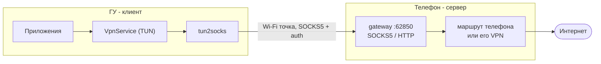

# TonLink Beta

Связка двух Android-приложений: клиент + сервер. Раздаёт интернет от сервера клиенту.

Сел в машину, сервер увидел BT-соединение, поднял туннель -> клиент увидел сервер -> интернет
появился сам. Сервер потерял BT-устройство -> туннель закрыт.

## Настройка

1) На телефон ставим сервер, выбираем BT-устройство-триггер (Geely) + генерируется код 6 символов.
2) На принимающую сторону (ГУ) ставим клиент, вводим код 6 символов с сервера.
3) Готово. Отключаем энергосбережение для этих приложений в системе, клиент при необходимости подкрепляем специальными возможностями для стабильного старта.

Есть настройки - возможно, на разных сетях что-то придётся подвигать. По умолчанию стоит то, что работает у меня.

### Разовый adb-грант на клиенте (рекомендуется)

```
adb shell pm grant com.salat.wifitonnellec android.permission.WRITE_SECURE_SETTINGS
```

Даёт клиенту право отключать системную проверку интернета (captive portal): сети связки её не проходят, и без гранта часть приложений считает, что интернета нет. Также нужен для прокси-режимов (PROXY/HYBRID). Переживает перезагрузки и обновления APK, слетает при удалении приложения - после переустановки повторить.

## Зачем

На Android 16 закрыли способ программного переключения точки доступа на телефоне, и автоматизировать передачу интернета с телефона на ГУ тривиальными способами больше нельзя. Цель проекта - научить Android 16 передавать интернет без открытия потенциально опасных гейтов вроде Shizuku и автоматизировать подключение.

Должно работать на 13+, но особо не тестировал со старыми версиями.

## Как работает



Телефон не становится роутером - он обычное приложение, которое принимает соединения и открывает их наружу. Клиент заворачивает трафик своих приложений в туннель.

Свой VPN на телефоне при этом работает: gateway ходит наружу через маршрут телефона по умолчанию, а значит и через его VPN.

Особенность: при работе вы не можете на устройстве-клиенте праллельно использовать отдельный VPN клиент (т.к. слот активного клиента занимает TonLink) но если сервер работает через VPN -> то клиент тоже работает через этот серверный VPN. Тоннель передаёт подключение сервера как есть.

## Связка

| | Сервер | Клиент |
|---|---|---|
| Где | телефон | ГУ |
| Пакет | `com.salat.wifitonnelles` | `com.salat.wifitonnellec` |
| Android | 13+ | 11+ |
| Роль | точка доступа + прокси | VPN + автоподключение |
